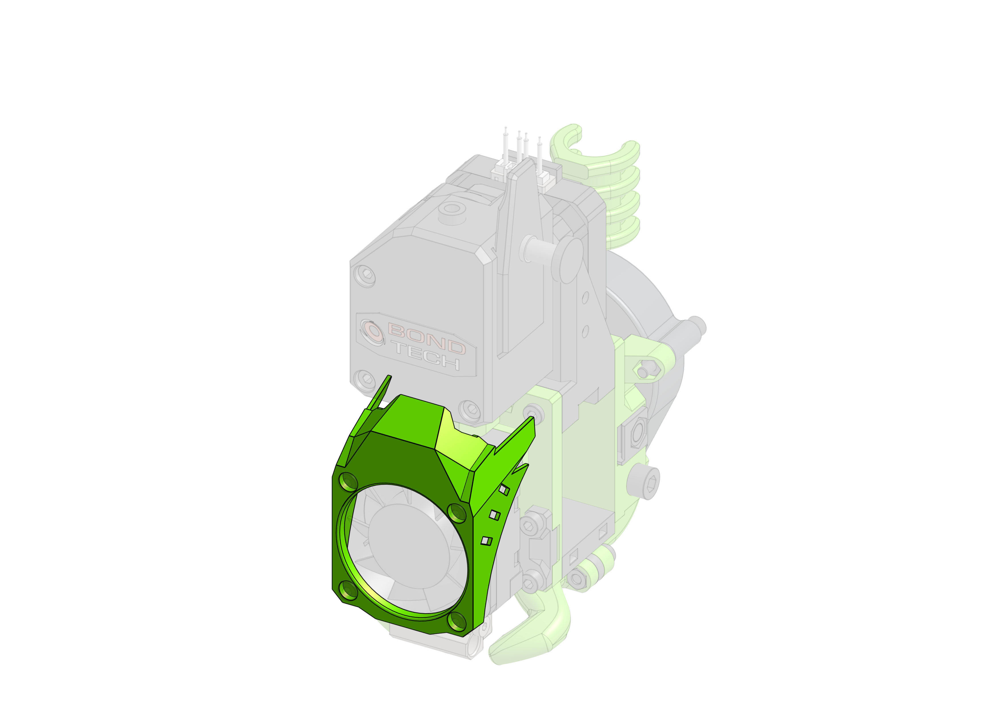

# LED Shroud



For those willing to put a little bit of bling on their printers: shroud with built-in Neopixel. When it's off it looks like just any other regular shroud. With LED on, EVA logo appears. As the intended LED is Neopixel, imagination is the only limit as to what it can do (printer status, heating progress, print progress etc etc)


## Wiring

As there are multiple boards and firmware flavors, providing instructions for each and every one of them is impossible (contributions welcome). 

=== "Raspberry Pi GPIO"
    === "Klipper linux mcu"
        Quoting the Klipper creator:

        !!! quote
            Unfortunately, the neopixel functionality doesn't currently work on the "linux mcu" implementation of Klipper.

            As we discussed on IRC, the neopixel requires very strict timing for its bit-banging interface. Specifically, a zero bit must be transmitted with a gpio pulse of no more than ~500ns. The "linux mcu" GPIO code uses the linux kernel gpio interface which isn't nearly fast enough to reach that rate. (In my tests, two back-to-back "toggle" commands took ~11us - way more than the required 500ns.)

            Unfortunately, I don't see a simple solution. It might be possible to obtain the necessary timing if the mcu code did direct register writes for gpio updates. However, that would require a lot of work.

            -Kevin

        https://github.com/KevinOConnor/klipper/issues/3366#issuecomment-699749451

=== "SKR Pro 1.x"
    Having analyzed schematics of the other SKR boards, that have dedicated Neopixel headers, and comparing with this one, pins were selected that connect to the same microcontroller ports. There may also be other pins that work, but those were tested and confirmed to work.

    

    !!! abstract "Data pin"
        Only one of those pins needs to be used. 

        - `PA1` or `PA2`- when using inductive probe (which uses 3 pins) instead of BLtouch one of the remaining pins can be used for Neopixels 
        - `PF13` - lowest right on EXP2
        - `PC9` - second from left, top row on EXTENSION-1


!!! info "Recommended"
    Neopixel documentation recommends putting 100 nF capacitor between `+` and `-`, to protect the LED from instant onrush of current when powering up 

!!! warning "Required"
    From intial testing, 470 Ohm resistor proved to be mandatory - as without it (or with different value) the LED showed unpredictable behaviour


## Configuration
In this section you'll find example config and macros for lighting effects (where applicable)
=== "Klipper"
    === "config"

        There is not much required to get Neopixels working on Klipper: add following to the `pinter.cfg`, restart and you're ready to send commands.

        ``` cfg
        [neopixel shroud]
        pin: PA1
        chain_count: 1
        color_order: GRB
        ```

        For more config options, see [Klipper docs](https://www.klipper3d.org/Config_Reference.html#neopixel).

        !!! note
            Although `GRB` is a safe bet for `color_order` on vast majority of Neopixels, the [through-hole LED's](https://www.adafruit.com/product/1938) are of `RGB` format

        But updating the config will not make the LED just work, as Klipper has no built-in lighting effects. 
        So controlling when and how the LED(-s) behave is entirely up to you.

        The very basic control can be achieved by sending following GCode to set red color at 100% brightness

        ``` raw
        SET_LED LED=shroud RED=1.0 GREEN=0.0 BLUE=0.0
        ```
        
        Which can be inserted into slicer's advanced GCode sections (start/end GCode, before/after layer change, pause print etc.)
        When combined with Klipper's powerful [Command Templates](https://www.klipper3d.org/Command_Templates.html), some truly awesome effects can be achieved.

        See [Klipper docs](https://www.klipper3d.org/G-Codes.html#neopixel-and-dotstar-commands) for more details


    === "tips & tricks"
        To keep the main config file clean you might want to store all Neopixel related stuff in a separate file, say `neopixel.cfg` which you'd include in your main config by adding following line

        ``` cfg
        [include neopixel.cfg]
        ```

        To quickly check whether Neopixel works and behaves as expected, use this code: 

        ``` raw
        [gcode_macro SHROUD_OFF]
        gcode:
            SET_LED LED=shroud RED=0.0 GREEN=0.0 BLUE=0.0

        [gcode_macro SHROUD_RED]
        gcode:
            SET_LED LED=shroud RED=1.0 GREEN=0.0 BLUE=0.0
        
        [gcode_macro SHROUD_GREEN]
        gcode:
            SET_LED LED=shroud RED=0.0 GREEN=1.0 BLUE=0.0
        
        [gcode_macro SHROUD_BLUE]
        gcode:
            SET_LED LED=shroud RED=0.0 GREEN=0.0 BLUE=1.0
        
        [gcode_macro SHROUD_WHITE]
        gcode:
            SET_LED LED=shroud RED=1.0 GREEN=1.0 BLUE=1.0
        ```
        This way, instead of each time having to type those long commands, you'd now be able to simply type `SHROUD_RED` to set it to red at 100% (decrease `RED=1.0` to a value of 0.5 if you want it at 50% brightness) 

        !!! info
            If you're using Fluidd, those macros will also automatically create buttons on your dashboard

## Examples

=== "Klipper"
    === "basic"
        Set LED startup color to blue (to indicate cold state)
        ``` cfg
        [neopixel shroud]
        pin: PA1
        chain_count: 1
        color_order: GRB
        initial_RED: 0.0
        initial_GREEN: 0.0
        initial_BLUE: 1.0
        ```

        Add following to slicer's start GCode, to change LED to green to indicate active state:
        ``` raw
        SET_LED LED=shroud RED=0.0 GREEN=1.0 BLUE=0.0
        ```

        and this to slicer's end GCode, to change LED back to cold state (blue color):
        ``` raw
        SET_LED LED=shroud RED=0.0 GREEN=0.0 BLUE=1.0
        ```

        Alternatively, if the macros have been set as in `tips & tricks` the above two GCodes could simply be replaced with:
        ``` raw
        SHROUD_GREEN
        ```

        and
        ``` raw
        SHROUD_BLUE
        ```
        respectively

    === "advanced"
        === "Temperature Reactive Leds"
            Increases the brightness from black to bright red based on extruder temperature. Shows green when extruder is safe to touch.

            ``` raw
            [gcode_macro M105]
            rename_existing: M105.1
            gcode:  

                M105.1

                
                #if the extruder is off
                

                    #Set the LED to red if the extruder is off but is still hot, otherwise 
                    # set the color to green
                    
                        SET_LED LED=shroud RED=1 GREEN=0 BLUE=0 INDEX=1  TRANSMIT=1
                    
                        SET_LED LED=shroud RED=0 GREEN=1 BLUE=0 INDEX=1  TRANSMIT=1
                         

                

                    #if the extruder temp is at target temperature 
                    
                        SET_LED LED=shroud RED=1 GREEN=0 BLUE=0 INDEX=1  TRANSMIT=1

                    #if the extruder is still heating
                    
                        
                        SET_LED LED=shroud RED={ scaler|float * 1 } GREEN=0 BLUE=0 INDEX=1  TRANSMIT=1
                      

                
                
            ```

            Author: mental ([source](https://klipper.info/macro-examples-1/mentals-temperature-reactive-leds))

            !!! info
                This macro passively waits for [M105 GCodes](https://marlinfw.org/docs/gcode/M105.html) being sent (constantly, due to the "nature" of the `M105`) so if none is sent, macro will not work. 
            
        === "Self-updating LED"
            Transition colors (automatically) from green to yellow to red, indicating nozzle warm-up progress.
            When cold, LED will light blue.

            ``` raw
            [delayed_gcode update_shroud]
            # start temp reporting 3s after printer entered "ready" state
            initial_duration: 3
            gcode:  
                
                #if the extruder is off
                

                    #Set the LED to yellow if the extruder is off but is still hot, otherwise 
                    # set the color to blue
                    
                        SET_LED LED=shroud RED=1 GREEN=1 BLUE=0 INDEX=1  TRANSMIT=1
                    
                        SET_LED LED=shroud RED=0 GREEN=0 BLUE=1 INDEX=1  TRANSMIT=1
                         

                

                    #if the extruder temp is at target temperature 
                    
                        SET_LED LED=shroud RED=1 GREEN=0 BLUE=0 INDEX=1  TRANSMIT=1

                    #if the extruder is still heating
                    
                        
                        SET_LED LED=shroud RED={ scaler|float * 1 } GREEN={ 1 - ( scaler|float * 1 ) } BLUE=0 INDEX=1  TRANSMIT=1
                      

                
                
                # repeat every 2s
                UPDATE_DELAYED_GCODE ID=update_shroud DURATION=2
            ```

            !!! tip
                To turn this macro off, following GCode needs to be sent to the printer:
                ``` raw
                UPDATE_DELAYED_GCODE ID=update_shroud DURATION=0
                ```


        === "Error State"
            It is also possible(-ish) to catch shutdown state of the printer and have it reported via LED color.

            Following code will lit LED pink if printer is about to go to shutdown state (M112 GCode received)
            ``` raw
            [gcode_macro M112]
            rename_existing: M112.1
            gcode:  
                SET_LED LED=shroud RED=1 GREEN=0 BLUE=1 INDEX=1  TRANSMIT=1
                G4 P3000
                M112.1
            ```

            !!! danger
                The `G4 P3000` tells the printer to wait 3s before shutting down (otherwise LED will not lit up). This is obviously not a recommended method and is posted more as an example that it is possible. Understand the implications and use at own risk.

## Links

{{ eva_download_button("led_shroud") }}

{{ eva_link("led_shroud") }}

{{ onshape_link("led_shroud") }}

## BOM

{{ bom("addons/led_shroud/bom/regular.csv", 4) }}


